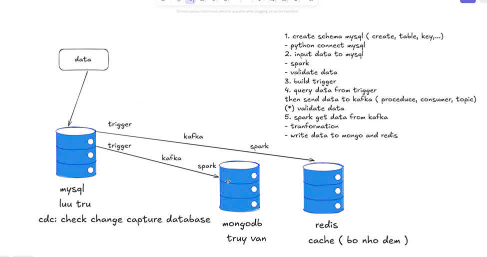

# 📦 Data Synchronization Project

### 📝 Project Description
This project aims to synchronize data across multiple databases.
It simulates a scenario where MySQL acts as the primary data source,
and all changes in MySQL are automatically propagated to MongoDB and
Redis to ensure data consistency across systems.

A trigger is created in MySQL to capture data changes, which are then pushed to Apache Kafka. Apache Spark consumes these Kafka events and synchronizes the changes to MongoDB and Redis in real time.



### 🚀 Features
- Real-time data synchronization from MySQL to MongoDB and Redis
- Uses MySQL trigger to capture changes (INSERT, UPDATE, DELETE)
- Apache Kafka for reliable change event streaming
- Apache Spark Structured Streaming for consuming and forwarding changes
- Ensures data consistency across all databases
- Modular design, easy to extend for additional targets or transformations

### 📂 Project Structure

├── config/ \
│ ├── database_config.py \
│ └── spark_config.py \
├── database/ \
│ ├── mongo_db_connect.py \
│ ├── mysql_connect.py \
│ ├── redis_connect.py \
│ └── schema_manager.py \
├── src/ \
│ ├── main.py \
│ ├── etl/ \
│ │ ├── consumer.py \
│ │ ├── sync_data_mongo.py \
│ │ ├── sync_data_with_mongo.py \
│ │ └── trigger_kafka.py \
│ └── spark/ \
│ │ ├── spark_main.py \
│ │ └── spark_write_database.py

### 🛠️ Setup Instructions
⚠️ Make sure you have docker installed.
#### 1. Clone the Repository
```https://github.com/hosi04/Data-Synchronization.git```

```cd data-synchronization-problem```
#### 2. Docker Setup
    2.1 Install $ run MySql on docker
    
    docker run --name mysql \
      -e MYSQL_ROOT_PASSWORD=your_password \
      -e MYSQL_DATABASE=your_database \
      -e MYSQL_USER=your_username \
      -e MYSQL_PASSWORD=your_password \
      -p 3306:3306 \
      -d mysql:8
    
    2.2 Install $ run MongoDB on docker

    docker run --name mongo \
      -e MONGO_INITDB_ROOT_USERNAME=your_username \
      -e MONGO_INITDB_ROOT_PASSWORD=your_password \
      -p 27017:27017 \
      -d mongo:6

    2.3 Install $ run Redis on docker

    docker run --name redis \
      -p 6379:6379 \
      -d redis:6

### ✍️ Author
- Gmail: hosinguyenn@gmail.com
- Phone: 0395612573
- Linkedin: https://tinyurl.com/hosi04 
- Github: https://github.com/hosi04